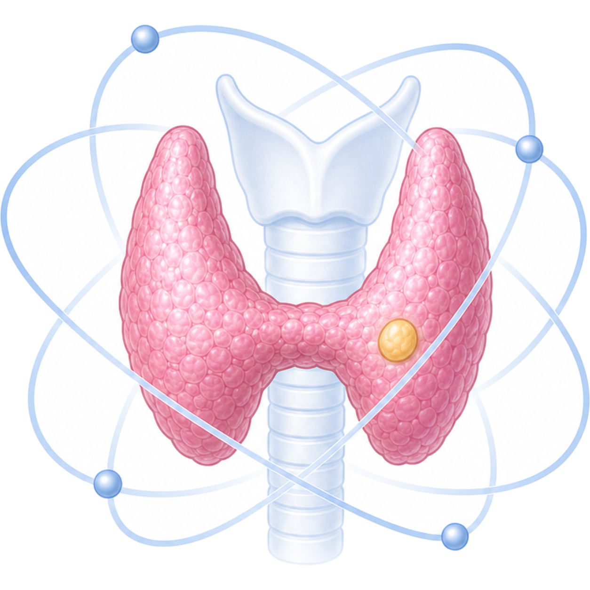

# ProPRINT



Prototype-Guided Protein Representation Inference from Thyroid Ultrasound
(ProPRINT) is a two-stage deep learning framework for inferring virtual protein
representations from thyroid ultrasound images.

## System Requirements

Validated environment:

- OS: Ubuntu 22.04 LTS
- Python: 3.10.12
- Environment manager: Conda
- Deep learning framework: PyTorch 2.3.1 (`+cu121`)
- CUDA:
  - PyTorch build: CUDA 12.1
  - Server driver/runtime validated on: NVIDIA Driver 580.76.05
- GPU: Validated on NVIDIA RTX A6000 (48 GB VRAM)
- System RAM: 32 GB or higher
- Common scientific Python packages listed in `requirements.txt`

Install dependencies:

```bash
pip install -r requirements.txt --extra-index-url https://download.pytorch.org/whl/cu121
```

ProPRINT uses MambaOut-small as the visual backbone. We acknowledge the
MambaOut project by Yu and Wang: https://github.com/yuweihao/MambaOut.

The bundled `MambaOut-main/models/mambaout.py` provides the MambaOut-small
backbone definition. Please download the MambaOut-small pretrained weights from
the MambaOut repository and place `mambaout_small.pth` under
`MambaOut-main/models/`, or set `MAMBA_PATH` to an external MambaOut directory.

## Repository Structure

```text
ProPRINT_public/
├── assets/
│   └── proprint_logo.png
├── proprint/
│   ├── model_proprint.py
│   ├── train_stageA.py
│   ├── train_stageB.py
│   ├── inference.py
│   └── utils_eval.py
├── utils/
│   └── dataset.py
├── MambaOut-main/
│   └── models/
│       └── mambaout.py
├── cluster_analysis/
│   └── results/
├── data/
├── weights/
│   └── proprint/
├── outputs/
│   └── proprint/
├── requirements.txt
└── README.md
```

Default paths:

- Data: `data/`
- Weights: `weights/proprint/`
- Outputs: `outputs/proprint/`
- Stage A prototype label files: `data/stageA_cluster_data/`

## Data Structure

Place files as follows:

```text
data/
├── stageA_clinical.xlsx
├── stageA_protein.xlsx
├── stageA_cluster_data/
│   ├── stageA_prototype_labels_malignant.csv
│   └── stageA_prototype_labels_all.csv
├── stageB_train.xlsx
├── stageB_internal_val.xlsx
├── stageB_external_val.xlsx
├── clinical_prospective.xlsx
├── stageA_ultrasound/
│   ├── 12345_1.jpg
│   ├── 12345_2.jpg
│   └── ...
├── stageB_ultrasound/
│   ├── 23456_1.jpg
│   ├── 23456_2.jpg
│   └── ...
└── inference_ultrasound/
    ├── 67890_1.jpg
    ├── 67890_2.jpg
    └── ...

weights/proprint/
├── proprint_stageA.pth
├── prototypes.npz
└── proprint_stageB_best.pth
```

Stage A, Stage B, and inference use separate default image folders. These image
folders can be changed with `--image_subdir`.

## Data Preparation

### Ultrasound Images

Image filenames should start with the corresponding `ID`, for example:

```text
12345_1.jpg
12345_2.jpg
12345.jpg
```

Multiple images per patient are supported. During validation, testing, and
inference, image-level probabilities are aggregated to patient-level probabilities
by default using max aggregation.

### Protein Matrix for Stage A

`stageA_protein.xlsx` should contain the preprocessed protein feature matrix used
for Stage A training. The `ID` column must match `stageA_clinical.xlsx`.

### Proteomic Prototype Labels for Stage A

Stage A expects precomputed proteomic prototype labels. Two files are used:

- `stageA_prototype_labels_malignant.csv`: malignant-only cluster labels used for prototype initialization and updates.
- `stageA_prototype_labels_all.csv`: benign and malignant prototype labels used for prototype-assignment supervision.

These prototype label files should be generated from the Stage A development
cohort only. External or prospective evaluation cohorts must not be used to fit
or define these labels.

Both files require:

```text
ID,cluster
```

Label convention:

```text
cluster = -1 -> benign prototype
cluster = 0  -> malignant prototype 1
cluster = 1  -> malignant prototype 2
...
```

## Step-by-Step Usage

### 1. Prepare Stage A Inputs

Place the paired ultrasound-protein data under `data/`:

```text
data/stageA_clinical.xlsx
data/stageA_protein.xlsx
data/stageA_ultrasound/
```

Place the precomputed prototype label CSV files under:

```text
data/stageA_cluster_data/
```

### 2. Run Stage A Training

```bash
python proprint/train_stageA.py
```

Input/output-related Stage A arguments:

- `--data_dir`: directory containing Stage A data files.
- `--image_subdir`: Stage A image folder under `data_dir`.
- `--cluster_assign_path`: optional malignant prototype label CSV. If omitted, the default file under `data/stageA_cluster_data/` is used.
- `--save_dir`: checkpoint and prototype output directory.
- `--output_dir`: output directory.
- `--protein_dim`: optional protein feature dimension check. If omitted, the dimension is inferred from `stageA_protein.xlsx`.

Stage A outputs:

```text
weights/proprint/proprint_stageA.pth
weights/proprint/prototypes.npz
```

### 3. Prepare Stage B Inputs

Place the ultrasound-only Stage B tables and images under `data/`:

```text
data/stageB_train.xlsx
data/stageB_internal_val.xlsx
data/stageB_external_val.xlsx
data/stageB_ultrasound/
```

The Stage B train, internal validation, and external validation tables must be
patient-disjoint.

### 4. Run Stage B Fine-Tuning

```bash
python proprint/train_stageB.py
```

Stage B outputs:

```text
weights/proprint/proprint_stageB_best.pth
outputs/proprint/proprint_stageB_predictions.xlsx
```

### 5. Run Inference on a Custom Dataset

```bash
python proprint/inference.py \
  --data_dir data \
  --clinical_file clinical_prospective.xlsx \
  --image_subdir inference_ultrasound \
  --model_path weights/proprint/proprint_stageB_best.pth \
  --prototype_path weights/proprint/prototypes.npz \
  --output_dir outputs/proprint \
  --output_prefix proprint_inference_predictions
```

Input/output-related inference arguments:

- `--data_dir`: directory containing the clinical file and image folder.
- `--clinical_file`: clinical `.xlsx` or `.csv` file.
- `--image_subdir`: image folder under `data_dir`.
- `--id_col`: patient ID column, default `ID`.
- `--label_col`: optional label column, default `Label`.
- `--image_exts`: image extensions to search, default `jpg,jpeg,png,bmp,tif,tiff`.
- `--model_path`: trained Stage B checkpoint.
- `--prototype_path`: prototype `.npz` file.
- `--output_dir`: output directory.
- `--output_prefix`: output filename prefix.
- `--aggregation`: patient-level image aggregation method, default `max`.
